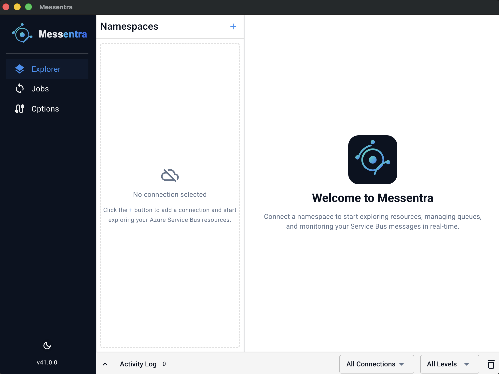
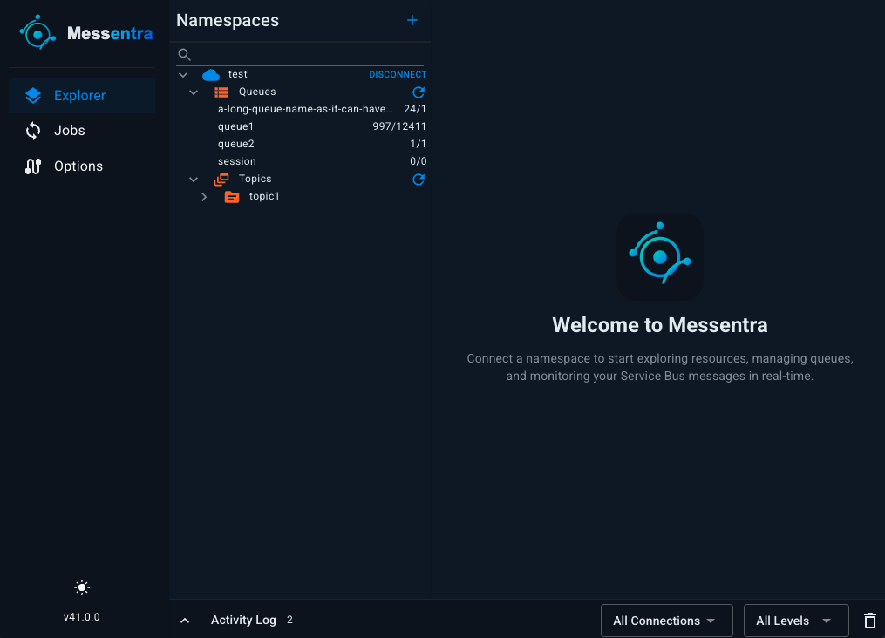
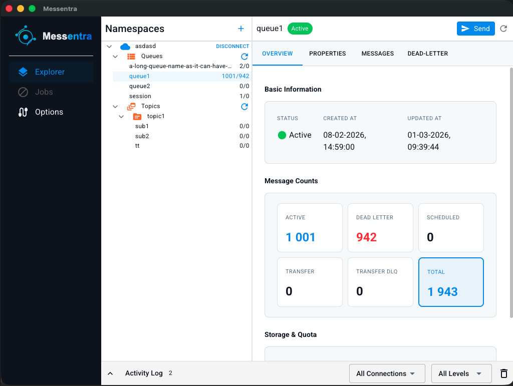
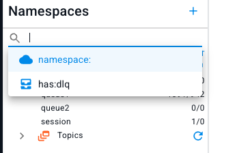
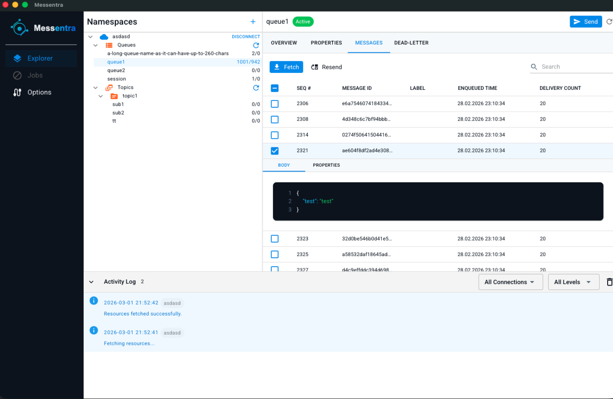
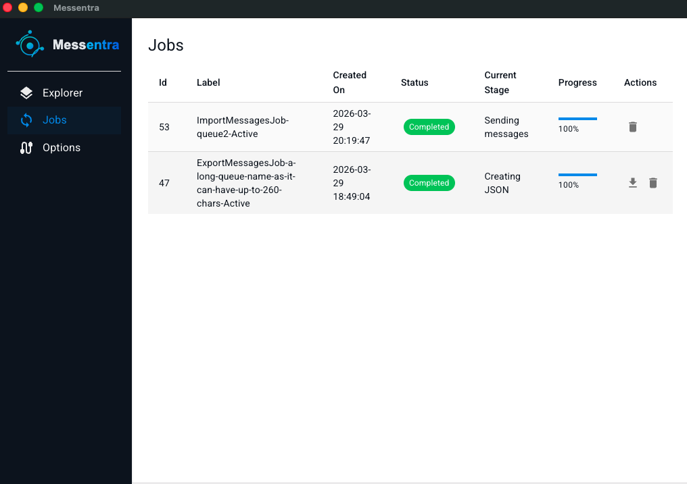
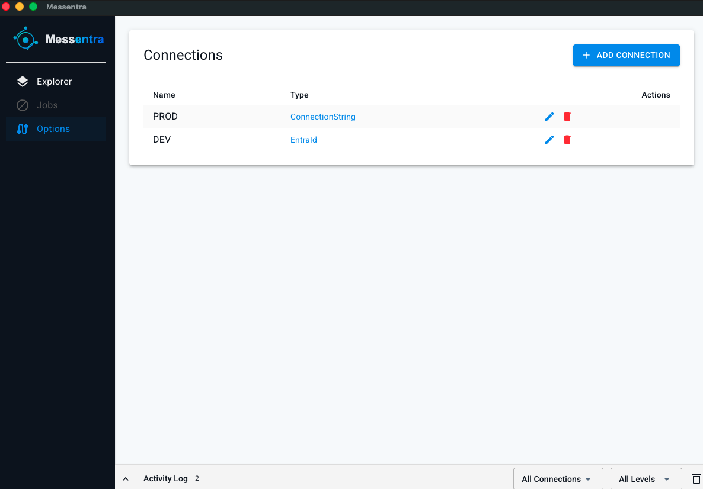

<p align="center">
  
</p>

# Messentra - Azure Service Bus Desktop Explorer

<p align="center">
  <a href="https://github.com/kamil-czarnecki/Messentra/releases"></a>
  <a href="https://dotnet.microsoft.com/en-us/download/dotnet/10.0"></a>
  <a href="LICENSE"></a>
  
</p>

<p align="center">
  A cross-platform desktop GUI for <strong>Azure Service Bus</strong> - browse resources, inspect and send messages, manage dead-letter queues - built with Blazor and Electron.NET.
</p>

---

## About

Messentra is an open-source, cross-platform desktop application for exploring and managing **Azure Service Bus** namespaces. It provides a clean, modern GUI for browsing queues, topics, and subscriptions; inspecting and sending messages; and managing dead-letter queues - without leaving your desktop. It supports both **Connection String** and **Entra ID (Azure AD)** authentication, making it suitable for local development as well as enterprise environments.

Built with **Blazor Server**, **Electron.NET**, **MudBlazor**, and **Fluxor**.

---
## Features

### 🔌 Connection Management
- Add, edit, and delete named namespace connections
- **Connection String** - paste a standard Azure Service Bus connection string
- **Entra ID** - authenticate using Tenant ID + Client ID (Azure AD / Microsoft Entra)
- Multiple connections managed side by side in the Explorer

### 🧪 Azure Service Bus Emulator Support
- Use a connection string in this format:

```text
Endpoint=sb://localhost:5300;SharedAccessKeyName=RootManageSharedAccessKey;SharedAccessKey=SAS_KEY_VALUE;UseDevelopmentEmulator=true;
```

- The `Endpoint` port (for example `:5300`) is important for emulator management operations.
- Current emulator support includes:
  - viewing resources
  - sending messages
  - fetching messages
- Limitation: active and dead-letter message counts are currently not supported by the emulator.

### 🗂️ Resource Explorer
- Browse **queues**, **topics**, and **subscriptions** in a collapsible tree
- Live message counts (active / dead-letter) shown inline in the tree
- Per-resource **Overview** tab: status, creation date, last updated date
- **Properties** tab: full resource configuration and storage & quota details
- **Dead-Letter** sub-queue accessible directly from the resource panel

### 📁 Custom (Virtual) Folders
Custom folders are virtual groups inside a namespace that help you organize resources by workflow, team, or incident context without changing anything in Azure.
- Create, rename, and delete folders per namespace
- Add queues and subscriptions to one or more folders
- Adding a topic to a folder automatically includes its subscriptions for quick triage
- Refresh a folder to refresh all resources currently grouped inside it

### 🔎 Resource Search & Filtering
- Smart search bar in the Explorer tree with **special-phrase autocomplete**
- **Plain text** - filter queues, topics, and subscriptions by name
- `namespace:x` - limit the tree to a specific namespace; autocomplete completes connected namespace names
- `has:dlq` - show only resources that currently have dead-letter messages
- Combine phrases freely: `namespace:prod has:dlq`, `namespace:prod orders`

### 📨 Message Fetching
- Fetch messages from queues and topic subscriptions
- Choose fetch mode: **Peek** (non-destructive) or **Receive**
  - **Peek** - configurable start sequence number for offset-based peeking
  - **Receive / PeekLock** - locks messages for explicit settlement; configurable wait time
  - **Receive / ReceiveAndDelete** - removes messages immediately on receive; configurable wait time
- Configurable fetch count
- Message list displays: Sequence #, Message ID, Label, Enqueued Time, Delivery Count
- Dead-letter queue view adds Reason and Error Description columns
- **Live search** across all visible message fields
- **Multi-select** messages for bulk operations
- Inline message viewer with **Body** (syntax-highlighted) and **Properties** tabs
- Properties include all broker properties (e.g. `ContentType`, `CorrelationId`, `TimeToLive`) and custom application properties

### 🛠️ Message Operations
Actions available on fetched messages vary by fetch mode:
- **Resend** - re-send selected message(s) back to the queue/topic
  - In **Peek** mode (non-destructive), the original message is not removed or settled
  - In **Receive** mode with **PeekLock**, successful resend completes the original message
  - In **ReceiveAndDelete** mode, resend simply sends a new copy (the original is already removed on receive)
  - In **Peek** and **ReceiveAndDelete**, this can intentionally create duplicates

- **Receive / PeekLock mode only: settlement operations**
  - **Complete** - settle and remove message(s) from the queue
  - **Abandon** - release the lock so message(s) become available again
  - **Dead-Letter** - move message(s) to the dead-letter sub-queue
  - Note: In **ReceiveAndDelete** mode, these settlement actions are not available (and are disabled in the UI) because messages are removed immediately when received.

### 📤 Send Message
- Send a message to any queue or topic
- Body format: **JSON** (with one-click formatting) or **Plain Text**
- Full broker properties: Label, Message ID, Correlation ID, Partition Key, Session ID, Reply-To Session ID, To, Reply-To, Content Type, Time-To-Live, Scheduled Enqueue Time
- Custom **application properties** (key/value pairs)

### 📦 Import & Export Messages
- **Export** messages from a queue or subscription to a JSON file for backup, replay, or sharing between environments
- **Import** messages from a JSON file into a selected queue or topic using the built-in template format
- **Import and export** run as background jobs, with their status visible on the Jobs page. Export jobs provide a downloadable file output; import jobs currently only report status (no output payload).
- **Disclaimer:** Import may introduce duplicate messages.

### ⌨️ Keyboard Shortcuts

| Shortcut | Context | Action |
|----------|---------|--------|
| `F5` | Resource Explorer tree (focused) | Refresh the selected resource |
| `↑` / `↓` | Messages grid (focused) | Navigate between messages |


### 📋 Activity Log
- Persistent activity log panel at the bottom showing connection and fetch events across all namespaces

### 🌙 Dark Mode
- Built-in dark mode for a comfortable viewing experience

---

## Screenshots

### Welcome


### Dark Mode


### Resource Explorer


### Resource Search & Filtering


### Messages


### Jobs


### Connections


---

## Alternative Tools

| Tool | Description |
|------|-------------|
| [ServiceBusExplorer](https://github.com/paolosalvatori/ServiceBusExplorer) | Feature-rich Windows desktop tool for Azure Service Bus by Paolo Salvatori |

---

## License

Messentra is licensed under the [GNU General Public License v3.0](LICENSE).
